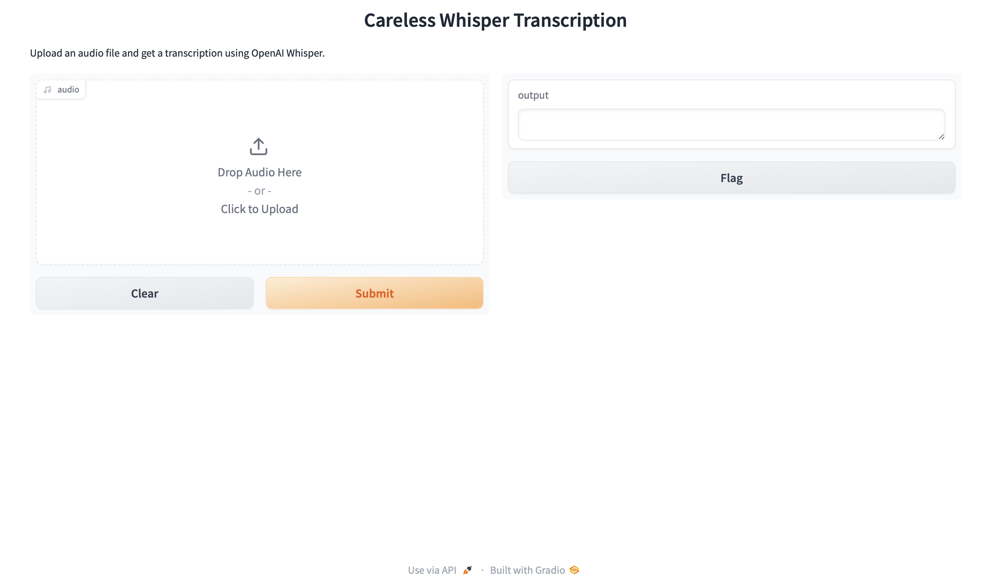

# 🎤 Careless Whisper - AI Web-Based Transcription App  

[](LICENSE)  
[](https://www.python.org/downloads/)  
[](https://openai.com/research/whisper)  

🚀 **Careless Whisper** is a **web-based transcription tool** that uses OpenAI’s **Whisper model** to transcribe audio files into text.  
This app runs **locally** on your machine, ensuring privacy while providing **real-time progress updates**.  

## **🔹 Features**  
✅ **Upload & Transcribe**: Supports `.mp3`, `.wav`, `.m4a` files.  
✅ **Real-Time Progress Bar**: See transcription progress as it happens.  
✅ **Live Streaming UI**: Dynamically updates as the text is transcribed.  
✅ **Supports Multiple Whisper Models**: Choose between `tiny`, `base`, `small`, `medium`, and `large`.  
✅ **Privacy-Friendly**: Runs entirely **locally**—no cloud processing.  
✅ **Download Transcription**: Save results as a `.txt` file.  

---

## **📸 Screenshots**  
  

---

## **💻 Installation & Usage**  
### **1️⃣ Prerequisites**  
Ensure you have:  
- **Python 3.8+** → [Download here](https://www.python.org/downloads/)  
- **FFmpeg** → Install via Homebrew:  
  ```bash
  brew install ffmpeg
  ```
- **Pip & Virtual Environment (Recommended)**

### **1️⃣ Prerequisites**  
